# ⚙️ Week 5 — OpenROAD Flow Installation and Floorplan + Placement

## 🧩 RISC-V Reference SoC Tapeout Program

Welcome to **Week 5** of the **RISC-V SoC Tapeout Program**, where you move from transistor-level circuit design to the **backend physical implementation flow** using **OpenROAD** — a fully automated, open-source RTL-to-GDSII system for digital IC design.

This week focuses on installing and validating the **OpenROAD Flow Scripts (ORFS)** environment and running the **Floorplan** and **Placement** stages of the design flow.

---

## 🎯 Objective

To set up the **OpenROAD Flow Scripts** environment and successfully execute **Floorplan** and **Placement** stages for a sample design.

This marks your transition from device-level simulation (Week 4) to **physical realization on silicon**, where logic gates are translated into geometric layouts.

---

## 🧠 Why This Task Is Important

After mastering SPICE-level CMOS behavior, you now see how those circuits are **placed and arranged physically** to form complete chips.

By completing this week, you’ll understand:

* How **core area and die dimensions** are defined during floorplanning.
* How **standard cells** are automatically placed to optimize area and timing.
* How **OpenROAD automates** complex backend stages in chip design.

---

## 🏗️ OpenROAD Flow Setup Steps

### 1️⃣ Clone the OpenROAD Repository

```bash
git clone --recursive https://github.com/The-OpenROAD-Project/OpenROAD-flow-scripts
cd OpenROAD-flow-scripts/
```

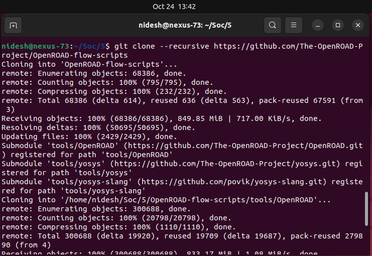

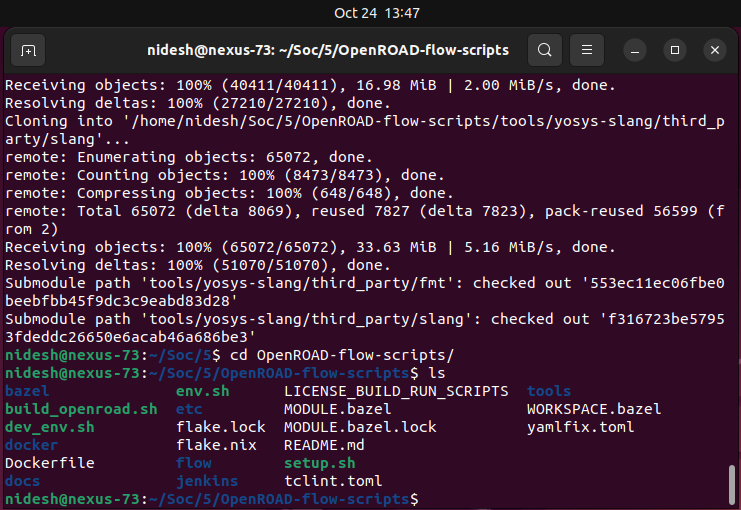

---

### 2️⃣ Run the Setup Script

```bash
sudo ./setup.sh
```

This installs all necessary dependencies and prepares the environment for compilation.


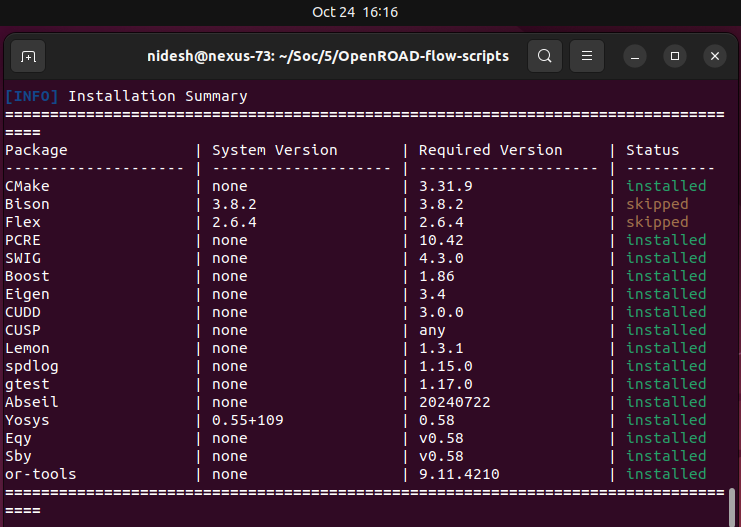

---

### 3️⃣ Build OpenROAD

```bash
./build_openroad.sh --local
```

This command compiles OpenROAD from source and installs the required flow binaries locally.

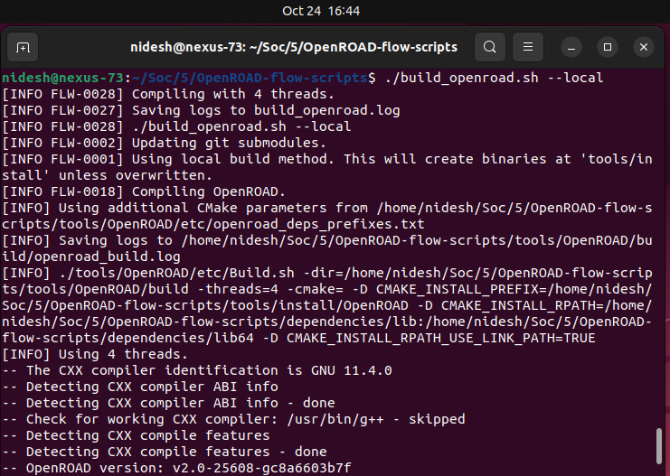

---

### 4️⃣ Source Environment and Verify Installation

```bash
source ./env.sh
yosys -help
openroad -help
```

Check that both `yosys` and `openroad` respond successfully — this confirms a valid installation.

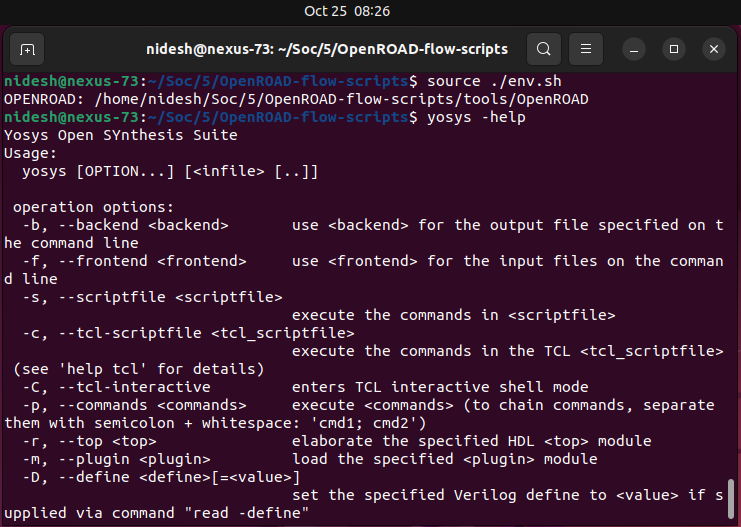

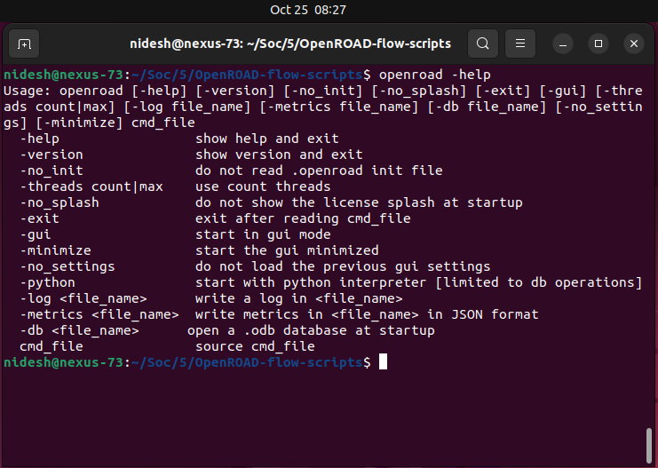

---

### 5️⃣ Run the OpenROAD Flow

```bash
cd flow/
make
```

This runs the flow using built-in example designs (such as `gcd` with the Nangate45 PDK).

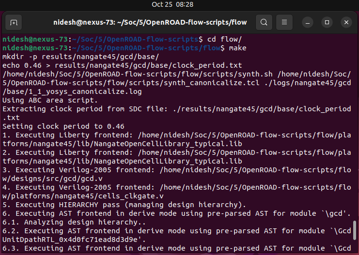

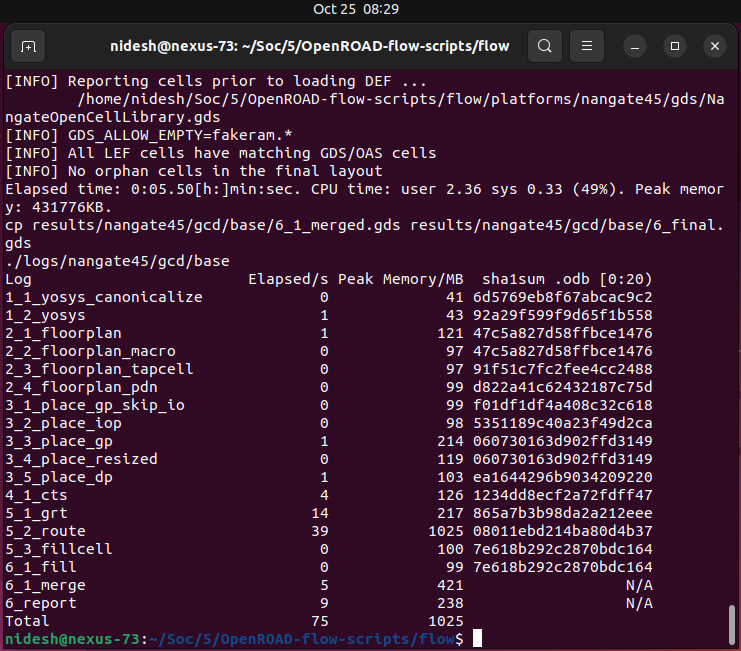

---

### 6️⃣ Launch the Graphical User Interface (GUI)

```bash
make gui_final
```

This opens the **OpenROAD GUI** showing the final placement and floorplan visualization.


✅ You should now see:

* The **core area** and **standard cell placement**.
* The **timing and slack charts** within the OpenROAD GUI.

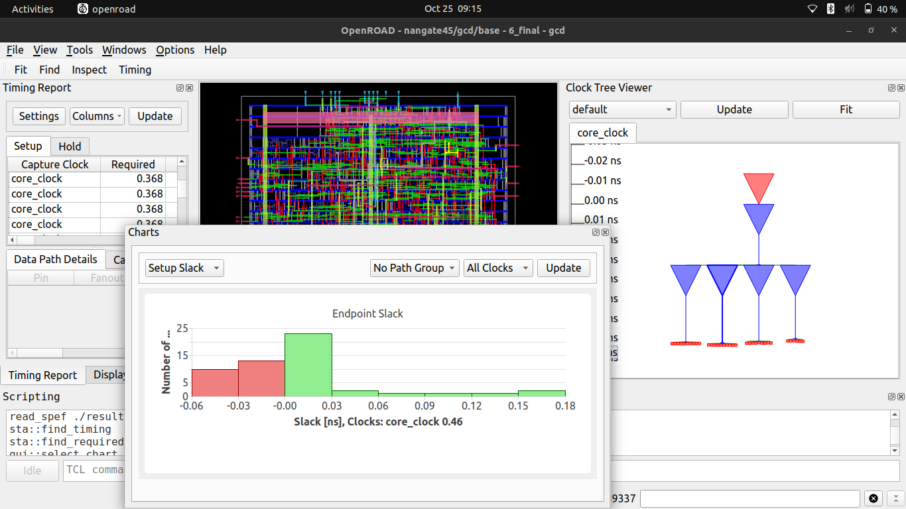

---

## 📂 ORFS Directory Structure Overview

```plaintext
OpenROAD-flow-scripts/
├── bazel/                     → Bazel build configuration files
├── build_openroad.sh           → Script to locally build the OpenROAD toolchain
├── build_openroad.log          → Build log file for OpenROAD compilation
├── dependencies/               → Installed libraries and dependencies (CUSP, headers, libs, etc.)
│   ├── bin/                    → Dependency executables
│   ├── include/                → Header files for dependencies
│   ├── lib/                    → Shared/static libraries
│   ├── share/                  → Shared dependency resources
│   └── README.md               → Notes about dependency setup
├── dev_env.sh                  → Developer environment setup script
├── docker/                     → Docker build definitions (builder & dev images)
│   ├── Dockerfile.builder
│   └── Dockerfile.dev
├── docs/                       → Documentation, Sphinx configs, and tutorials
│   ├── images/                 → Reference images for documentation
│   ├── tutorials/              → User and contributor tutorials
│   ├── conf.py                 → Sphinx documentation configuration
│   └── README.md               → Docs overview
├── etc/                        → Helper shell scripts for dependencies and Docker
│   ├── DependencyInstaller.sh
│   ├── DockerHelper.sh
│   └── DockerTag.sh
├── flow/                       → Core RTL-to-GDSII flow environment
│   ├── designs/                → Example RTL designs (e.g., gcd)
│   ├── platforms/              → Technology libraries and PDK files (e.g., Nangate45)
│   ├── scripts/                → Flow automation Tcl scripts
│   ├── reports/                → Generated timing/area reports
│   ├── results/                → Flow outputs (ODB, DEF, GDS, logs, etc.)
│   ├── logs/                   → Stepwise tool logs (synthesis, placement, etc.)
│   ├── Makefile                → Defines and controls the end-to-end flow
│   └── tutorials/              → Example runs for new users
├── jenkins/                    → Regression and CI test configurations
├── tools/                      → Installed EDA tools and utilities
│   ├── OpenROAD/               → Compiled OpenROAD binaries
│   ├── yosys/                  → Logic synthesis tool binaries
│   ├── yosys-slang/            → Verilog frontend for Yosys
│   ├── yosys_util/             → Helper scripts for Yosys
│   ├── codespace/              → Developer support scripts
│   └── AutoTuner/              → Optimization modules
├── env.sh                      → Environment setup script (source before running flow)
├── LICENSE_BUILD_RUN_SCRIPTS   → License file for the build/run scripts
├── README.md                   → Main repository overview
└── WORKSPACE.bazel             → Bazel workspace descriptor
```

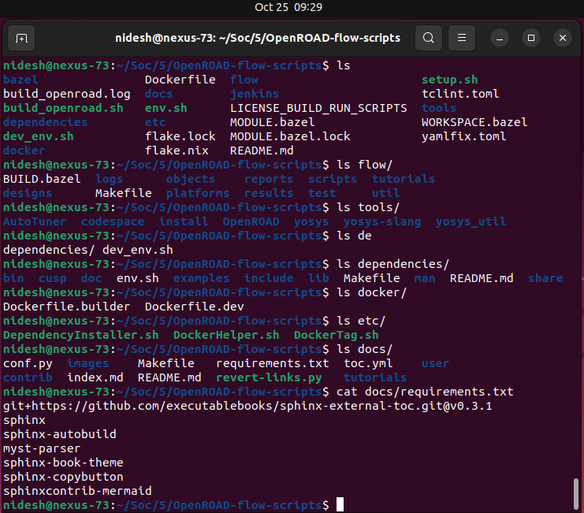

---

## 🧩 Execution Outputs

* **Floorplan:** Core area and die boundary generated successfully.
* **Placement:** Standard cells placed within the defined core region.

## Floorplan Output


## Placement output
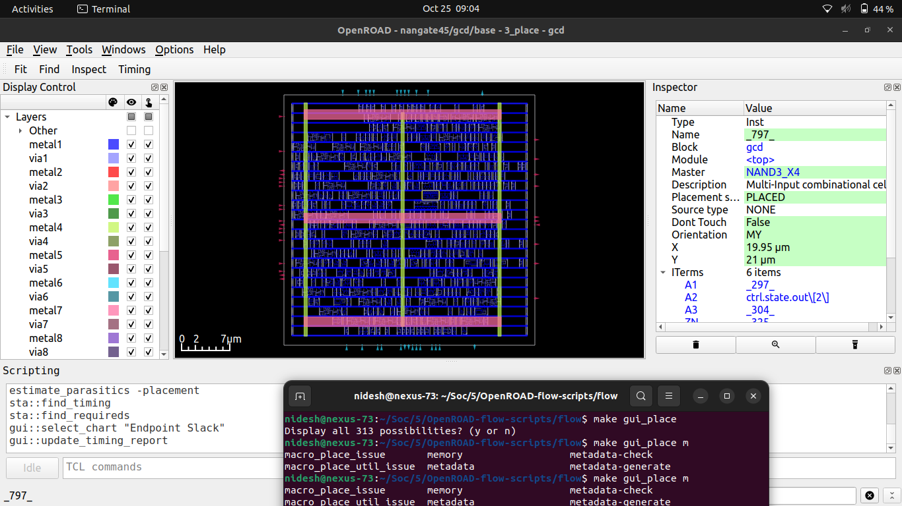
---

## 🧾 Summary

This week, we:

* Installed and verified **OpenROAD Flow Scripts** on Ubuntu.
* Ran the flow up to **Floorplan and Placement stages**.
* Visualized the final layout using the **OpenROAD GUI**.

### ⚙️ Key Learnings

* Transitioned from transistor-level design to backend automation.
* Understood physical design data flow and intermediate formats.
* Observed the correlation between netlist logic and physical layout.

---

## 🪶 Reference

* [spatha0011 / VSD Hardware Design Program (Day 14)](https://github.com/spatha0011/spatha_vsd-hdp/blob/main/Day14/README.md)

---

### ⚠️ Endnote — Resolving `./build_openroad.sh --local` Errors

If you encounter compilation or build errors while running:

```bash
./build_openroad.sh --local
```

you can resolve them by modifying the OpenROAD CMake configuration:

1. Open the file:

```bash
tools/OpenROAD/CMakeLists.txt
```

2. Apply the following changes:

* Ensure `target_compile_definitions` and `link_libraries(stdc++fs)` blocks are present as shown.
* Disable test builds by commenting out or removing `add_subdirectory(test)` lines.
* Adjust compiler version checks if using GCC ≥ 9.1 to avoid unnecessary `stdc++fs` linking.

### Complete new ```CMakeLists.txt```

```plaintext

# SPDX-License-Identifier: BSD-3-Clause
# Copyright (c) 2019-2025, The OpenROAD Authors

cmake_minimum_required (VERSION 3.16)

# Use standard target names
cmake_policy(SET CMP0078 NEW)
cmake_policy(SET CMP0086 NEW)
cmake_policy(SET CMP0074 NEW)
cmake_policy(SET CMP0071 NEW)
cmake_policy(SET CMP0077 NEW)

# Interfers with Qt so off by default.
option(LINK_TIME_OPTIMIZATION "Flag to control link time optimization: off by default" OFF)
if (LINK_TIME_OPTIMIZATION)
  set(CMAKE_INTERPROCEDURAL_OPTIMIZATION TRUE)
endif()

# Allow to use external shared boost libraries
option(USE_SYSTEM_BOOST "Use system shared Boost libraries" OFF)

# Allow to use external shared opensta libraries
option(USE_SYSTEM_OPENSTA "Use system shared OpenSTA library" OFF)

# Allow to use external shared abc libraries
option(USE_SYSTEM_ABC "Use system shared ABC library" OFF)

# Disable tests completely
set(ENABLE_TESTS OFF)

# Sanitizer options (disabled by default)
option(ASAN "Enable Address Sanitizer" OFF)
option(TSAN "Enable Thread Sanitizer" OFF)
option(UBSAN "Enable Undefined Behavior Sanitizer" OFF)

project(OpenROAD VERSION 1 LANGUAGES CXX)

set(OPENROAD_HOME ${PROJECT_SOURCE_DIR})
set(OPENROAD_SHARE ${CMAKE_INSTALL_PREFIX}/share/openroad)

set(CMAKE_CXX_STANDARD 17 CACHE STRING "the C++ standard to use for this project")
set(CMAKE_CXX_STANDARD_REQUIRED ON)
set(CMAKE_CXX_EXTENSIONS OFF)

list(APPEND CMAKE_MODULE_PATH "${CMAKE_CURRENT_SOURCE_DIR}/cmake")

# Get version string in OPENROAD_VERSION
if(NOT OPENROAD_VERSION)
  include(GetGitRevisionDescription)
  git_describe(OPENROAD_VERSION)
  string(FIND ${OPENROAD_VERSION} "NOTFOUND" GIT_DESCRIBE_NOTFOUND)
  if(${GIT_DESCRIBE_NOTFOUND} GREATER -1)
    message(WARNING "OpenROAD git describe failed, using sha1 instead")
    get_git_head_revision(GIT_REFSPEC OPENROAD_VERSION)
  endif()
endif()

message(STATUS "OpenROAD version: ${OPENROAD_VERSION}")

# Default to building optimized/release executable
if(NOT CMAKE_BUILD_TYPE)
  set(CMAKE_BUILD_TYPE RELEASE)
endif()

if(CMAKE_CXX_COMPILER_ID STREQUAL "GNU")
  if(CMAKE_CXX_COMPILER_VERSION VERSION_LESS "8.3.0")
    message(FATAL_ERROR "Insufficient gcc version. Found ${CMAKE_CXX_COMPILER_VERSION}, but require >= 8.3.0.")
  endif()
elseif(CMAKE_CXX_COMPILER_ID STREQUAL "Clang")
  if(CMAKE_CXX_COMPILER_VERSION VERSION_LESS "7.0.0")
    message(FATAL_ERROR "Insufficient Clang version. Found ${CMAKE_CXX_COMPILER_VERSION}, but require >= 7.0.0.")
  endif()
elseif(CMAKE_CXX_COMPILER_ID STREQUAL "AppleClang")
  if(CMAKE_CXX_COMPILER_VERSION VERSION_LESS "12.0.0")
    message(FATAL_ERROR "Insufficient AppleClang version. Found ${CMAKE_CXX_COMPILER_VERSION}, but require >= 12.0.0.")
  endif()
else()
  message(WARNING "Compiler ${CMAKE_CXX_COMPILER_ID} is not officially supported.")
endif()

message(STATUS "System name: ${CMAKE_SYSTEM_NAME}")
message(STATUS "Compiler: ${CMAKE_CXX_COMPILER_ID} ${CMAKE_CXX_COMPILER_VERSION}")
message(STATUS "Build type: ${CMAKE_BUILD_TYPE}")
message(STATUS "Install prefix: ${CMAKE_INSTALL_PREFIX}")
message(STATUS "C++ Standard: ${CMAKE_CXX_STANDARD}")
message(STATUS "C++ Standard Required: ${CMAKE_CXX_STANDARD_REQUIRED}")
message(STATUS "C++ Extensions: ${CMAKE_CXX_EXTENSIONS}")

# Configure version header
configure_file(
  ${OPENROAD_HOME}/include/ord/Version.hh.cmake
  ${OPENROAD_HOME}/include/ord/Version.hh
)

################################################################
if (CMAKE_CXX_COMPILER_ID STREQUAL "GNU" AND CMAKE_CXX_COMPILER_VERSION VERSION_LESS "9.1")
  MESSAGE(STATUS "Older version of GCC detected. Linking against stdc++fs")
  link_libraries(stdc++fs)
endif()

set(CMAKE_EXPORT_COMPILE_COMMANDS 1)

add_subdirectory(third-party)

# Disable tests entirely
# (removed add_custom_target(build_and_test) and GoogleTest include)
add_subdirectory(src)
# add_subdirectory(test)

target_compile_definitions(openroad PRIVATE GPU)

if(BUILD_PYTHON)
  target_compile_definitions(openroad PRIVATE BUILD_PYTHON=1)
else()
  target_compile_definitions(openroad PRIVATE BUILD_PYTHON=0)
endif()

if(BUILD_GUI)
  target_compile_definitions(openroad PRIVATE BUILD_GUI=1)
else()
  target_compile_definitions(openroad PRIVATE BUILD_GUI=0)
endif()

####################################################################
# Build man pages (Optional)
option(BUILD_MAN "Enable building man pages" OFF)

if(BUILD_MAN)
  message(STATUS "man is enabled")
  include(ProcessorCount)
  ProcessorCount(PROCESSOR_COUNT)
  message(STATUS "Number of processor cores: ${PROCESSOR_COUNT}")
  add_custom_target(
    man_page ALL
    COMMAND make clean && make preprocess && make all -j${PROCESSOR_COUNT}
    WORKING_DIRECTORY ${OPENROAD_HOME}/docs
  )
  install(DIRECTORY ${OPENROAD_HOME}/docs/cat DESTINATION ${OPENROAD_SHARE}/man)
  install(DIRECTORY ${OPENROAD_HOME}/docs/html DESTINATION ${OPENROAD_SHARE}/man)
endif()

####################################################################
set(CMAKE_CXX_FLAGS_RELEASEWITHASSERTS "${CMAKE_CXX_FLAGS_RELEASE} -UNDEBUG" CACHE STRING "" FORCE)
set(CMAKE_C_FLAGS_RELEASEWITHASSERTS "${CMAKE_C_FLAGS_RELEASE} -UNDEBUG" CACHE STRING "" FORCE)

```
These modifications ensure:

* Proper handling of **GCC/Clang versions**.
* Avoidance of **Qt and test-related build issues**.
* Successful **local build** of OpenROAD binaries.

After editing, re-run:

```bash
./build_openroad.sh --local
```

✅ This should complete the OpenROAD build without errors and prepare the flow for use.

---

🏁 End of Week 5

This marks the completion of Week 5, where you successfully installed the OpenROAD Flow Scripts environment and executed the **Floorplan and Placement** stages of the RISC-V SoC design. You now have a clear understanding of how standard cells are arranged and constrained to optimize timing and area on silicon.

Next, in 👉 **Week 6 – Clock Tree Synthesis and Routing**, you’ll take the floorplanned design from this week and implement **clock distribution and routing**. This stage will help you understand how interconnects, clock skew, and routing congestion affect performance, moving closer to a fully routed and sign-off-ready design. 🕒✨
